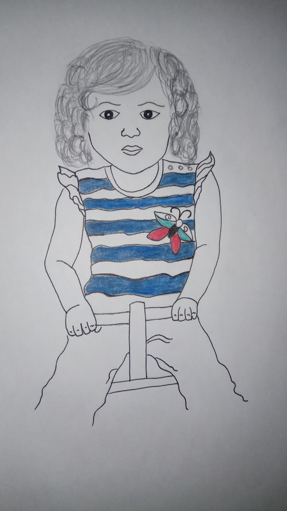
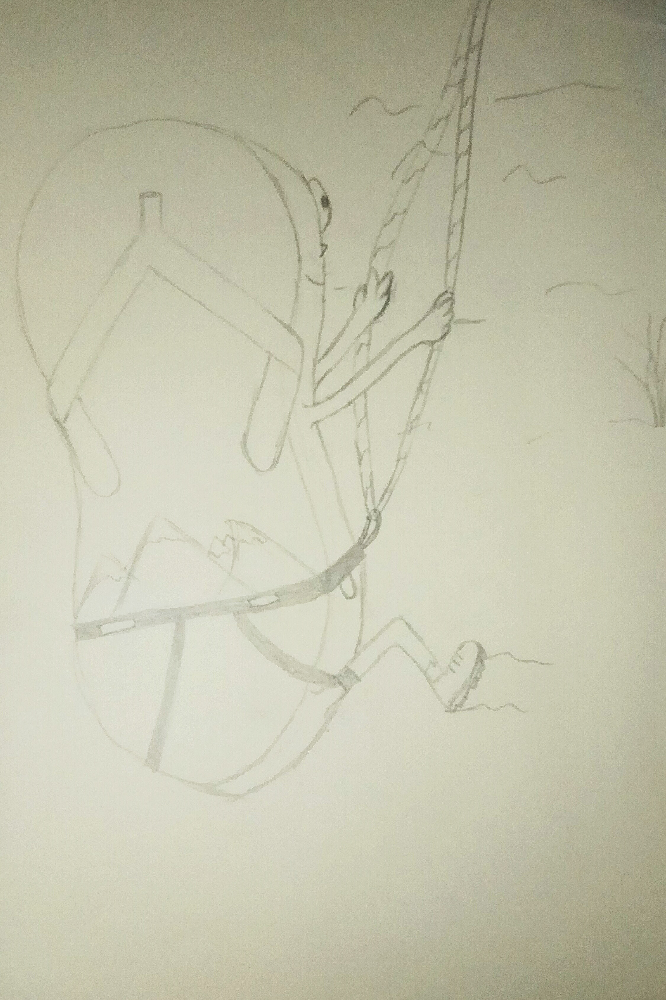
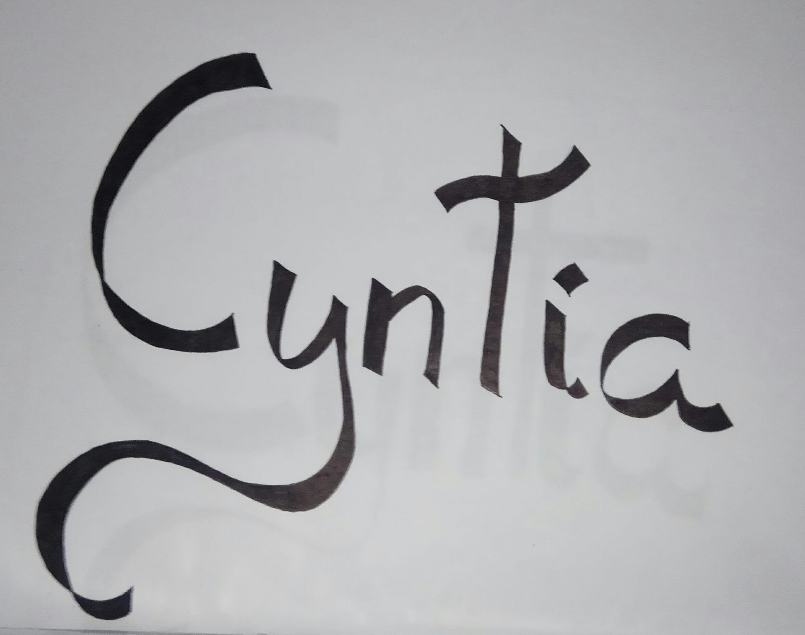
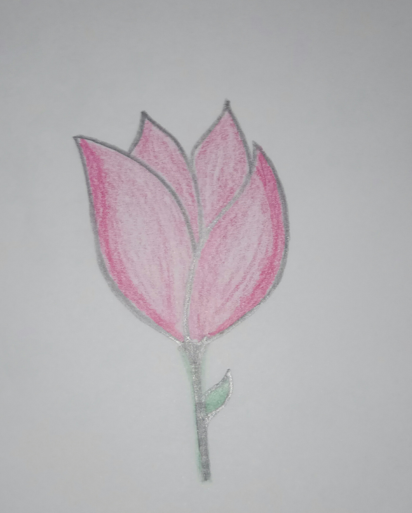
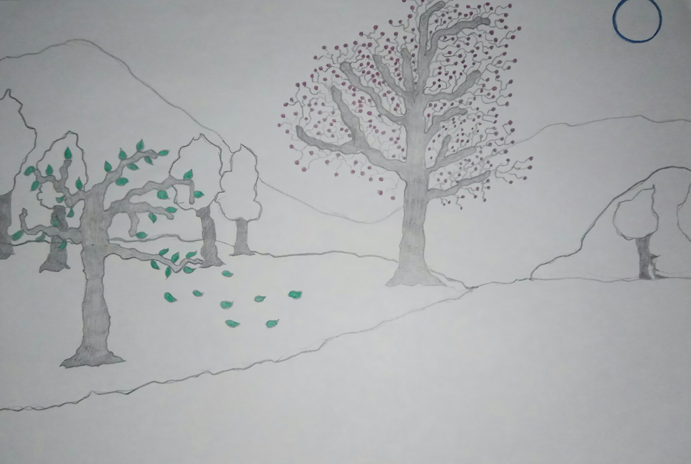
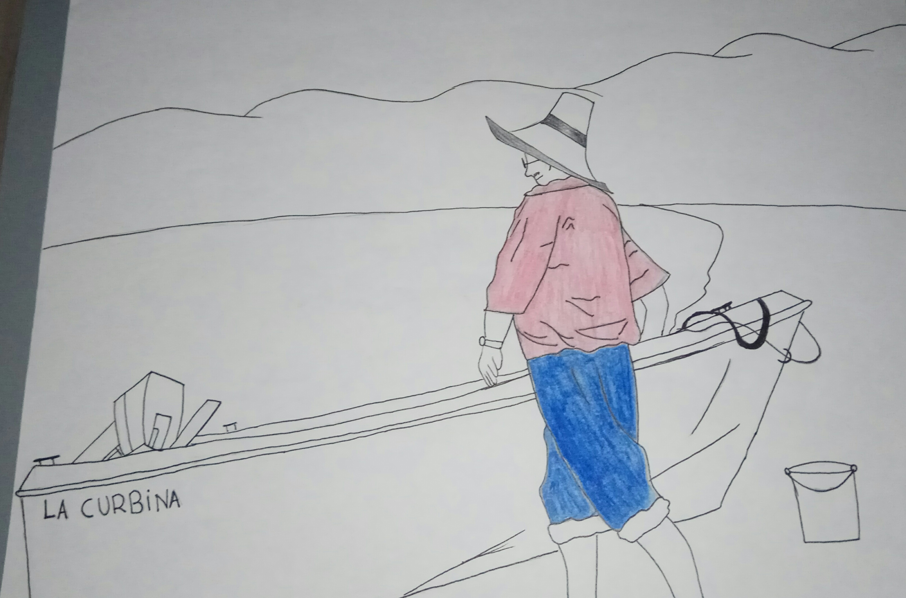
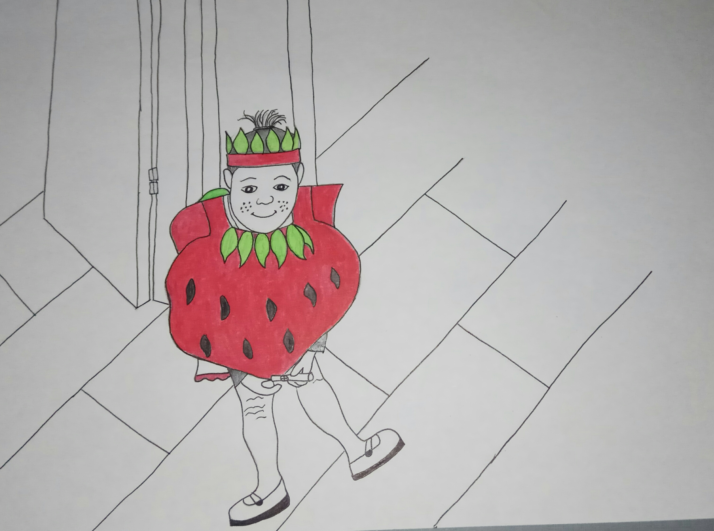
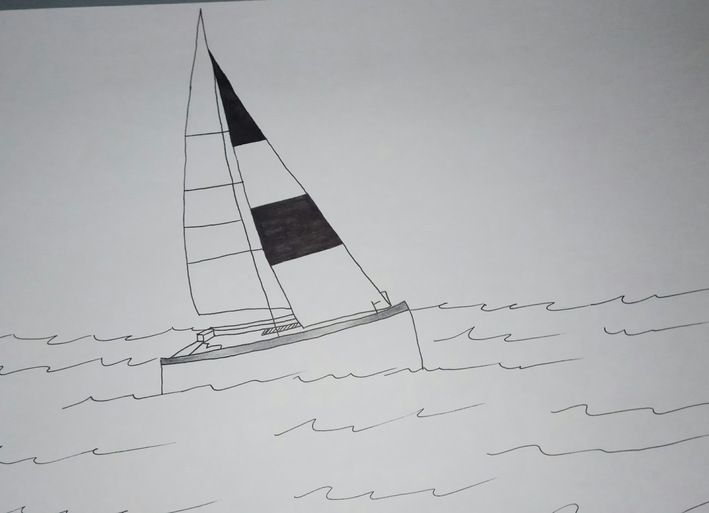
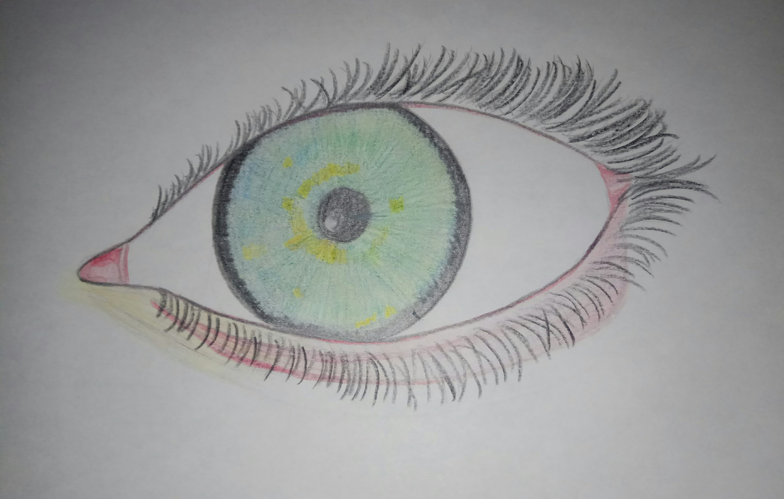
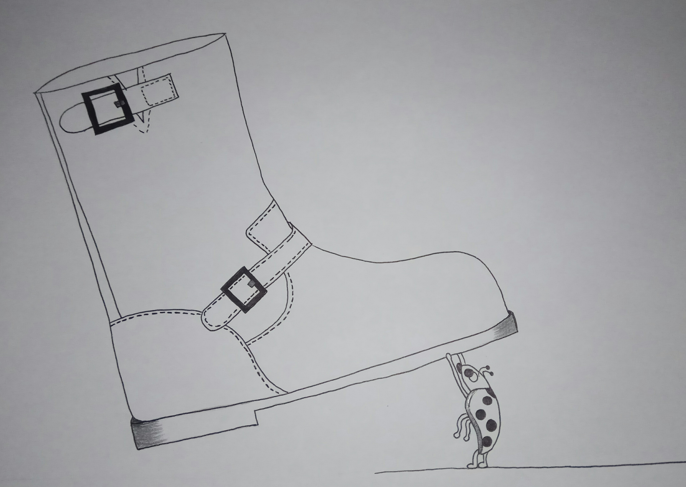

# Diseño Gráfico

* Catálogo la Visita: Ilustraciones de la portada, contraportada, maquetación y diseño propio.

* Imagen corporativa Alquímia: Diseño del logotipo y los flayers de publicidad, para academia de estudios.

* Bodegón de pluma y reloj: Ilustraciones digitales con photoshop, trabajos de clase.

* Manual corporativo: Manual de imagen corporativa de horus logotipo creado para estudio de tatuajes.

* Libro cocina: Libro de recetas para proyecto final de maquetación, las ilustraciones son todas propias.

* Tipografía personalizada : Es una tipografia creada desde cero como proyecto de clase.

